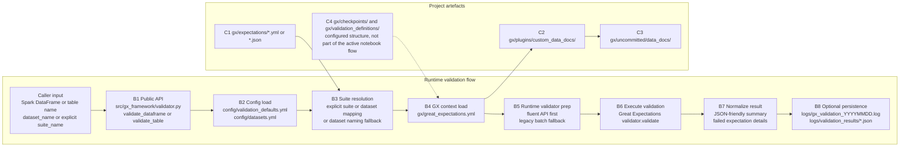

# Great Expectations + PySpark Data Quality Framework

This repository now centers on a lean Great Expectations integration built around `gx_framework` and a single primary notebook workflow.

## Active Contract

The supported public entry points are:

```python
from gx_framework import validate_dataframe, validate_table

dataframe_result = validate_dataframe(
    df=df,
    dataset_name="green_tripdata_2017",
    save_results=True,
)

table_result = validate_table(
    table_name="demo_green_tripdata_2017",
    dataset_name="green_tripdata_2017",
    save_results=False,
)
```

These functions:

- load runtime defaults from `config/validation_defaults.yml`
- resolve dataset-to-suite mappings from `config/datasets.yml`
- initialize the Great Expectations project under `gx/`
- run validation against the resolved expectation suite
- optionally append per-expectation validation metrics to a Delta path for historical tracking
- return a simplified JSON-serializable result contract

## Primary Workflow

Use `notebooks/02_validate_with_gx_framework.ipynb` as the primary demonstration and acceptance path. It shows:

- loading the sample CSV into Spark
- validating a Spark DataFrame with `validate_dataframe(...)`
- validating a Spark table with `validate_table(...)`
- inspecting the returned summary payload
- locating logs, saved validation results, and Delta-backed metrics outputs
- trending retained expectation metrics across multiple validation runs
- demonstrating how failed validations persist failure metrics for later analysis

The notebook is intentionally thin. Framework logic stays in `src/gx_framework/`.

For the metrics sections, use `config/validation_defaults.metrics_demo.yml` as the reusable example config instead of creating a temporary config file in the notebook.

## Process Flow

If you want to open the diagram in a Mermaid-only previewer, use `docs/process-flow.mmd`.



## Repository Layout

- `src/gx_framework/`: active framework modules
- `config/`: active runtime defaults and dataset mapping
- `gx/`: Great Expectations project, suites, and generated artefacts
- `notebooks/02_validate_with_gx_framework.ipynb`: primary notebook entry point
- `tests/`: retained test suite for the active implementation
- `archive/legacy-dq/`: archived legacy wrapper implementation, historical notebooks, tests, and docs

## Environment Setup

Python requirements:

- Python `3.10` to `3.13`
- Java runtime for PySpark

Local setup:

```bash
source .venv/bin/activate
uv sync --extra notebook --extra test
```

Optional notebook kernel registration:

```bash
source .venv/bin/activate
python -m ipykernel install --user --name great-expectations --display-name "Python (.venv) great-expectations"
```

## Running Tests

The supported tests are the gx_framework-focused tests in `tests/`:

- `test_config.py`
- `test_logger.py`
- `test_suite_resolver.py`
- `test_validator.py`
- `test_end_to_end.py`

Run them with:

```bash
source .venv/bin/activate
uv run pytest tests/test_config.py tests/test_logger.py tests/test_suite_resolver.py tests/test_validator.py tests/test_end_to_end.py
```

## Outputs

- structured logs: `logs/gx_validation_YYYYMMDD.log`
- saved result payloads: `logs/validation_results/*.json`
- optional Delta metrics store: `logs/dq_metrics.delta/`
- notebook metrics demo config: `config/validation_defaults.metrics_demo.yml`
- notebook metrics demo Delta store: `logs/notebook_demo_dq_metrics.delta/`
- GX Data Docs and validation artefacts: under `gx/uncommitted/`

## Archived Material

The previous `dq` wrapper path, its prototype scripts, its historical notebooks, and its contract test have been moved under `archive/legacy-dq/`.
