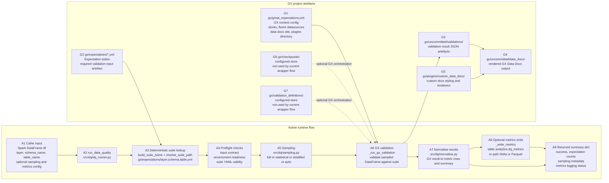

# Great Expectations + PySpark Lakehouse Data Quality Framework

This repository contains a convention-driven DQ framework for Microsoft Fabric Spark.

## Conventions

- Expectation suite name: `{layer}.{schema}.{table}`
- Suite file path: `gx/expectations/{layer}.{schema}.{table}.yml`
- No suite scanning and no metadata registry lookup

## Core Contract

`dq.run_data_quality` (importable from notebooks or Python modules):

```python
from dq import run_data_quality

run_data_quality(
    df,
    layer: str,
    schema_name: str,
    table_name: str,
    sampling_config: dict | None = None,
    log_metrics: bool = True,
    dq_metrics_table: str = "analytics.dq_metrics",
    dq_metrics_path: str | None = None,
    storage_profile: str = "local_fs",  # local_fs | azurite_blob
    source_format: str = "csv",         # csv | parquet | delta
    metrics_sink: str = "table",        # table | path
    metrics_format: str = "delta",      # delta | parquet
) -> dict
```

The wrapper derives suite names deterministically and does not require callers to
pass a suite name.

## Process Flow

The diagram below shows the active wrapper execution path implemented in `src/dq/`,
plus the GX project artefacts in `gx/` that supply configuration, expectations,
and generated outputs.

If you want to open this diagram in a Mermaid-only previewer, use
`docs/process-flow.mmd`. Markdown preview should render the diagram directly from
this README.



Active execution today is the `run_data_quality` path in `src/dq/`: caller input,
suite resolution, preflight validation, sampling, GX validation, normalization,
optional metrics persistence, and the returned summary. The `gx/checkpoints/` and
`gx/validation_definitions/` artefacts are part of the GX project structure and
stores configured in `gx/great_expectations.yml`, but they are not invoked by the
current wrapper implementation.

### Runtime Activity Reference

| Activity | Element | Description / function | Inputs | Outputs |
| --- | --- | --- | --- | --- |
| A1 | Caller input | Provides the dataset and the identifiers used to derive the GX suite name. This is the process entry point from a notebook, script, or test. | Spark DataFrame `df`; `layer`; `schema_name`; `table_name`; optional `sampling_config`; optional metrics and storage settings | Invocation payload passed to `run_data_quality` |
| A2 | `run_data_quality` | Orchestrates the end-to-end DQ lifecycle and coordinates validation, sampling, normalization, and logging. | Caller payload from A1 | Validated process context; derived suite name; summary or error response |
| A3 | Deterministic suite lookup | Builds `layer.schema.table` and resolves the suite file path under `gx/expectations`. No registry lookup or suite scanning is used. | `layer`; `schema_name`; `table_name`; optional `project_root` | `suite_name`; suite file path such as `gx/expectations/bronze.sales.green_2017_test.yml` |
| A4 | Preflight checks | Confirms the suite exists and that the runtime can execute GX deterministically. Includes input validation, environment readiness checks, and suite YAML validation. | DataFrame; resolved suite path; storage and metrics settings | Either a valid execution state or an early error payload such as `invalid_input`, `suite_invalid`, `suite_missing`, or `environment_error` |
| A5 | Sampling | Applies the configured sampling strategy before validation. The code supports `full`, `statistical`, `stratified`, and `auto`. | Input DataFrame; optional `sampling_config` | Sampled DataFrame; sampling metadata including strategy, confidence, row counts, and `stratify_by` |
| A6 | GX validation | Runs the sampled DataFrame against the resolved expectation suite through Great Expectations. | Sampled DataFrame; `suite_name`; `run_id`; suite file path; GX context configuration | GX validation result payload with expectation-level outcomes |
| A7 | Normalise results | Flattens the GX validation payload into metric rows and builds a compact run summary for downstream logging and reporting. | GX validation result; run metadata | Metric rows list; summary dict with success and expectation counts |
| A8 | Optional metrics write | Persists metric rows when `log_metrics=True`. Supports table sink or path sink and Delta or Parquet formats. | Spark session; metric rows; sink configuration; optional `dq_metrics_path` | Persisted metrics rows count; sink metadata; optional logging error details |
| A9 | Returned summary dict | Returns the process outcome to the caller, including validation results summary, sampling metadata, and metrics logging status. | Summary from A7 plus logging status from A8 | Final response dict consumed by notebooks, scripts, or tests |

### GX Artefact Reference

| Element | Artefact | Role in the process | Inputs it depends on | Outputs it provides |
| --- | --- | --- | --- | --- |
| G1 | `gx/great_expectations.yml` | Defines the GX context used by the wrapper, including stores, fluent Spark datasources, Data Docs site configuration, and plugin directory. | GX project configuration values and `uncommitted/config_variables.yml` | Active GX context configuration for validation, storage, and docs generation |
| G2 | `gx/expectations/*.yml` | Stores the expectation suites that the wrapper resolves and executes. This is the core validation input artefact. | Deterministic suite naming convention `layer.schema.table` and authored expectation definitions | Executable expectation suite consumed in A3 and A6 |
| G3 | `gx/uncommitted/validations/` | Stores validation result JSON artefacts emitted by GX runs. | GX validation execution results from A6 | Validation result artefacts that can feed Data Docs and audit trails |
| G4 | `gx/uncommitted/data_docs/` | Hosts rendered GX Data Docs for human-readable review of expectations and validation outcomes. | Validation artefacts from G3; site configuration from G1; optional custom rendering from G5 | HTML Data Docs output |
| G5 | `gx/plugins/custom_data_docs/` | Extends or styles the generated Data Docs presentation. | Custom renderers, styles, and views placed in the plugin directory | Customised Data Docs rendering behaviour |
| G6 | `gx/checkpoints/` | Configured GX checkpoint store. Present in the project structure but not called by the current wrapper flow. | Optional future checkpoint definitions | Potential orchestrated GX validation runs outside the current `run_data_quality` path |
| G7 | `gx/validation_definitions/` | Configured store for GX validation definitions. Present in the project structure but not used by the current wrapper flow. | Optional future validation definition artefacts | Potential reusable GX validation definitions outside the current wrapper path |

## Environment Readiness

The function validates that the runtime environment can support deterministic suite
execution before running GX validation. Preflight checks include:

- Great Expectations import availability
- PySpark import availability
- Spark DataFrame compatibility (`df.sparkSession`)
- Expectations directory availability under `gx/expectations`

If a suite is missing, the wrapper returns a clear error with the derived suite
name and expected file location:

```text
Expectation suite not found:
bronze.nyc_taxi.green_trips

Expected location:
.../gx/expectations/bronze.nyc_taxi.green_trips.yml
```

## Fabric Usage

1. Attach an Environment with required libraries (including Great Expectations).
2. If you enable metrics logging to a table, provision `analytics.dq_metrics` in your Fabric environment.
3. In a notebook, import and call the wrapper directly:

```python
from dq import run_data_quality

summary = run_data_quality(
    df=df,
    layer="bronze",
    schema_name="nyc_taxi",
    table_name="green_trips",
)
```

## Sampling Modes

- `full`: full dataset scan
- `statistical`: Cochran + finite population correction
- `stratified`: `sampleBy` by selected column
- `auto`: stratified when `stratify_by` is provided, otherwise statistical

When computed sample size is greater than or equal to population size, full scan is used.

## Pipeline Stability Notes (Fabric)

- Prefer Environment-managed libraries for production pipelines.
- Avoid inline `%pip` in referenced notebooks for pipeline runs.
- Keep table notebooks thin and orchestration-focused.

## Local Notebook Setup

Install notebook dependencies (including `ipykernel`) from `pyproject.toml`:

```bash
source .venv/bin/activate
uv sync --extra notebook
```

Register a reusable kernel for this environment:

```bash
source .venv/bin/activate
python -m ipykernel install --user --name great-expectations --display-name "Python (.venv) great-expectations"
```

Then select the `Python (.venv) great-expectations` kernel in VS Code/Jupyter notebooks.

## Local Run (Sample Dataset)

Use `src/optimised-04.py` to run wrapper-first GX validation locally against
`data/green_tripdata_2017_sample.csv`.

Prerequisites:

- Python `3.10` to `3.13` (do not use `3.14+` for current GX versions)
- Java runtime for PySpark (Debian example: `openjdk-21-jre-headless`)

Tested setup and run commands:

```bash
# 1) Install Java (Debian trixie)
sudo apt-get update
sudo apt-get install -y openjdk-21-jre-headless

# 2) Create the project virtual environment
uv venv

# 3) Install project dependencies
source .venv/bin/activate
uv sync --extra notebook

# 4) Run local GX validation via the wrapper API
python src/optimised-04.py
```
